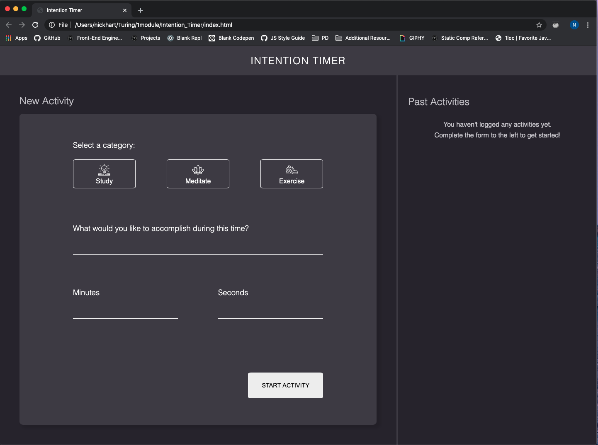
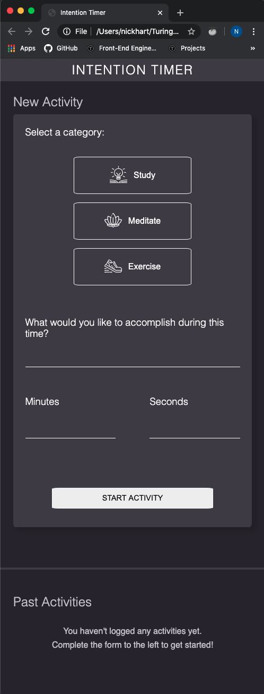
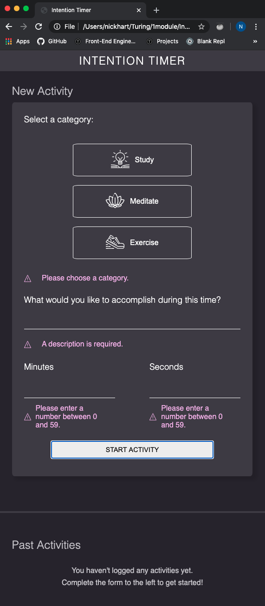
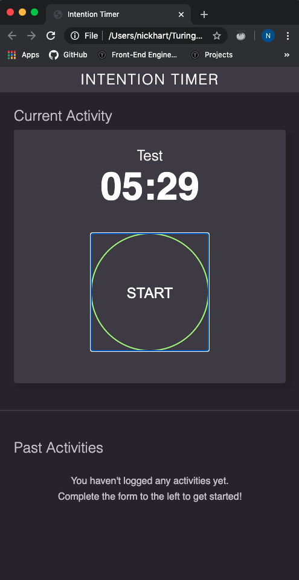

# Intention_Timer

## Objective

**Intention Timer** is a group project designed to increase understanding of the fundamentals of JS, HTML, and CSS and how those three languages are interwoven to create a functioning webpage. Our group worked closely together to create a working countdown timer based on user inputs for minutes, seconds, and activity type.

This project aligns with the goals set in our DTR to respect our individual needs for creating and maintaining health-positive habits that in turn help us learn more effectively.

## Contributors
- [**Hanna Kim**](https://github.com/hannakim91)
- [**Nick Hart**](https://github.com/nickhartdev)
- [**Chadrick Dickerson**](https://github.com/chadrick-d-dev)

## Additional Links
- **[Deployed Page](https://nickhartdev.github.io/Intention_Timer/)**
- **[Project Board](https://github.com/nickhartdev/Intention_Timer/projects/1)**
- **[GitHub Link](https://github.com/nickhartdev/Intention_Timer)**
- **[Team DTR](https://gist.github.com/nickhartdev/857df23059be59dc29b5751cd00fd2ad)**

## Successes

- **Creating a responsive site from the ground up**: We were given screenshots of a comp to replicate, a few assets, a color palette, and nothing more. The experience of working as a team to recreate the comp largely from scratch was an amazing learning opportunity for all of us.
- **Navigating a team dynamic**: Up until this point, our projects have either been done solo or with partners. This, being our first project being done with a group of three, was a great opportunity to practice efficient communication, collaboration, and project planning within a small team.
- **Integrating JavaScript, HTML, and CSS**: While our last project was done with basic DOM manipulation, this was the first time we built all three components of the site from the ground up. Getting to see how they all fit together helped build our understanding of a fuller picture of front-end development.

## Challenges

- **Refactoring**: Refactoring some of our first iteration of functions was challenging at times.
With each attempt at refactoring came the opportunity to learn through trial and error powered by critical thinking and group discussion.
- **Timer Functionality**: We ran into some roadblocks along the way while creating functionality for the countdown timer. One issue was knowing where to place the `setInterval()` and corresponding `clearInterval()` functions. We had to play around with creating different iterations of related functions several times to get the timer to count down and stop successfully.
- **CSS Styling for Responsiveness**: We found it took a lot of trial and error with CSS styling to maintain page responsiveness for the page we initially created. The most difficult aspect was getting our styles to display desirably for the size of a mobile device.

## Progression
### **Layout**
  We built a static comp using HTML and CSS according to project spec's with colors and assets provided.
  We used two media queries in the CSS to provide responsive transitions for different sized views.  
  
  
  
### Activity Input Form
  The **New Activity** form was designed with user-error and bug prevention in mind: the form prevents users from being able to click the **Start Activity** button unless they've selected an activity category, filled in the line for an activity description, and added numeric values for how many minutes and seconds they want to spend on their activity. The page limits activities to 59 minutes and 59 seconds total.  
  
  
### Start Timer Button
  After a user fills out the New Activity form and clicks the **Start Activity** button, they are taken to an alternative page view with their activity description as the header, a timer, and a start button in view. When they click the *Start* button, the timer starts counting down. Once the timer hits 0 minutes and 0 seconds, an alert notifies users the timer has run out.  
  
  

### **Built With:**
* Vanilla JavaScript
* HTML
* CSS
